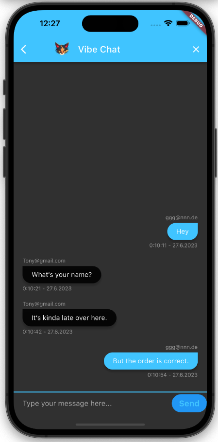
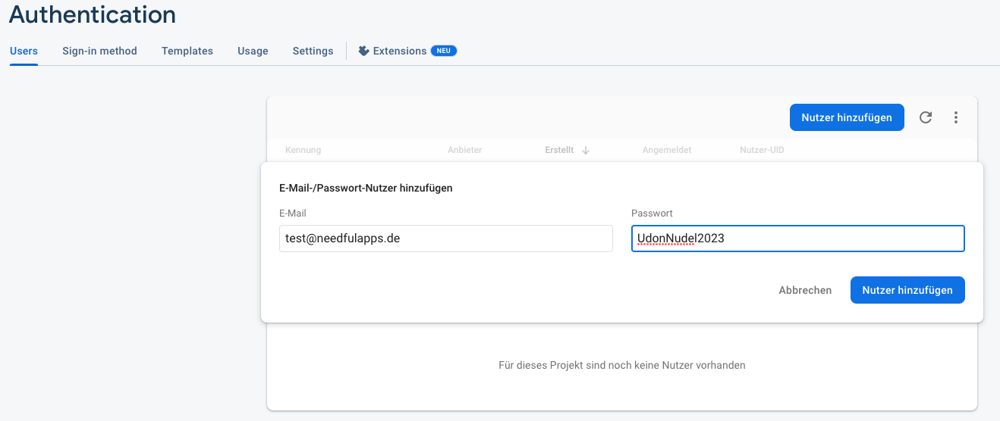

# Kapitel 2 - Firebase
## Was wir lernen
* Hero Animations
* Firebase
* Authentication
* Firestore
* Streams

## Was wir programmieren

| Vibe Chat - Eine App für eine einzigen große Gruppenchat |
|---------------------------------------------------------------------------|
|                                                |


Wir schreiben die App Vibe Chat. 
Die App ermöglicht es User*innen mit anderen User*innen zu chatten.


<details>
<summary>Abschnitt 1</summary>

# Kaltstart

## Übung
Nutze die Flutter-Dokumentation und finde heraus, wie Named Routes funktionieren.
Lege dann die Routes in `main.dart` an.
Als `initialRoute` soll `WelcomeScreen` verwendet werden.

## static und const

"Static" ist ein Schlüsselwort in vielen Programmiersprachen, einschließlich Dart, das eine spezifische Variable oder Methode zu einer Klasse gehört und nicht zu einer Instanz dieser Klasse. Mit anderen Worten, static-Member (Variablen oder Methoden) sind Klassenmitglieder und nicht Objekt- oder Instanzmitglieder.

Schauen wir uns ein Beispiel an:

```dart
class MyClass {
  static int staticVar = 0;

  static void printStaticVar() {
    print('Der Wert von staticVar ist: $staticVar');
  }
}

void main() {
  MyClass.staticVar = 10;
  MyClass.printStaticVar();
}
```

In diesem Beispiel gehört `staticVar` und `printStaticVar` zur `MyClass` und nicht zu einer bestimmten Instanz von `MyClass`. Daher können wir direkt auf `staticVar` und `printStaticVar` zugreifen, ohne eine Instanz von `MyClass` zu erstellen.

Die Ausgabe dieses Programms wäre: "Der Wert von staticVar ist: 10"

"Static const" in Dart ist ein Begriff, der verwendet wird, um Konstanten auf Klassenebene zu deklarieren. Eine "static const" Variable ist eine Konstante, die auf Klassenebene und nicht auf Instanzebene definiert ist. Einmal definiert, kann ihr Wert nicht geändert werden.

Hier ist ein Beispiel:

```dart
class MyClass {
  static const int kConst = 10;
}

void main() {
  print(MyClass.kConst);
}
```

In diesem Beispiel ist `kConst` eine "static const"-Variable. Ihr Wert kann nach der Definition nicht mehr geändert werden. Wir können direkt auf `kConst` zugreifen, ohne eine Instanz von `kConst` zu erstellen.

Die Ausgabe dieses Programms wäre: "10"

## Übung
* Die Buttonst `Login`und `Register` in `WelcomeScreen` sollen mit der Route `LoginScreen` bzw. `RegisterScreen` verlinkt werden.

* Ändere auf beiden Screens die Hintergrundfarbe zu schwarz und repariere das Logo.


# Hero Animation

Hero-Animationen in Flutter bieten eine einfache und effektive Möglichkeit, Übergänge zwischen Bildschirmen (oder Routen, wie sie in Flutter genannt werden) zu gestalten. Sie werden oft verwendet, um ein fließendes, nahtloses Erlebnis zu schaffen, wenn ein Element von einem Bildschirm zum nächsten "fliegt".

Im Wesentlichen ermöglicht eine Hero-Animation, dass ein gemeinsames Element (das als "Hero-Widget" bezeichnet wird) zwischen zwei Bildschirmen in einer Art flüssiger Animation geteilt wird. Dies hilft dabei, Kontinuität zwischen verschiedenen Teilen der Benutzeroberfläche herzustellen.

Ein typisches Beispiel für eine Hero-Animation könnte das eines Bildes in einer Bildergalerie sein. Wenn ein Benutzer auf ein Bild in einer Liste tippt, kann das Bild sich vergrößern und zu einem vollständigen Bildschirm übergehen. Dabei bleibt die Kontinuität zwischen der Galerie und dem Vollbildmodus bestehen.

So erstellst du eine einfache Hero-Animation in Flutter:

```dart
// Screen 1
Hero(
  tag: 'myHero',
  child: Image.network('https://example.com/my-image.jpg'),
)

// Screen 2
Hero(
  tag: 'myHero',
  child: Image.network('https://example.com/my-image.jpg'),
)
```

In diesem Beispiel teilen die beiden Bildschirme ein gemeinsames Bild als Hero-Widget. Das `tag`-Argument ist ein eindeutiger Identifikator, der das Hero-Widget auf beiden Bildschirmen verbindet. Wenn du von Bildschirm 1 zu Bildschirm 2 navigierst, wird das Bild flüssig von seiner Position und Größe auf Bildschirm 1 zu seiner Position und Größe auf Bildschirm 2 animiert. 

Hinweis: Flutter kümmert sich um die Details der Animation, so dass du dich auf das Erstellen des Hero-Widgets konzentrieren kannst.


## Übung
Überarbeite die Logos auf den Screens `WelcomeScreen`, `LoginScreen` und `RegisterScreen` zu Hero-Animationen.

```dart
    Hero(tag: 'logo', child: Image.asset('assets/images/vibe_chat.png'))
```

## Custom Animation
Um benutzerdefinierte Animationen in Flutter zu erstellen, benötigst du in der Regel die folgenden Komponenten:

1. Ein `Ticker`: Ein Ticker in Flutter erzeugt jedes Frame eine Callback-Funktion, um das Update der Animation auszulösen. Es ist im Wesentlichen ein Timer, der jedes Mal tickt, wenn der Bildschirm ein neues Bild zeichnet (normalerweise 60 Mal pro Sekunde).

2. Ein `AnimationController`: Dies ist ein spezielles Objekt, das die Animation steuert. Du kannst es verwenden, um die Animation zu starten, zu stoppen oder umzukehren, oder um den Fortschritt der Animation zu kontrollieren.

3. Ein `Animation`-Objekt: Dieses repräsentiert den aktuellen Wert der Animation sowie seinen Status (z.B. ob sie vorwärts oder rückwärts läuft, oder ob sie beendet ist).

Schauen wir uns ein einfaches Beispiel an:

```dart
class MyAnimatedWidget extends StatefulWidget {
  @override
  _MyAnimatedWidgetState createState() => _MyAnimatedWidgetState();
}

class _MyAnimatedWidgetState extends State<MyAnimatedWidget> with SingleTickerProviderStateMixin {
  AnimationController _controller;
  Animation<double> _animation;

  @override
  void initState() {
    super.initState();

    _controller = AnimationController(
      duration: const Duration(seconds: 2),
      vsync: this,
    );

    _animation = Tween<double>(
      begin: 0,
      end: 1,
    ).animate(_controller)
      ..addListener(() {
        setState(() {
          // refresh state to update UI
        });
      });

    _controller.forward();
  }

  @override
  Widget build(BuildContext context) {
    return Opacity(
      opacity: _animation.value,
      child: FlutterLogo(size: 100),
    );
  }

  @override
  void dispose() {
    _controller.dispose();
    super.dispose();
  }
}
```

In diesem Beispiel erstellen wir eine einfache Fade-In-Animation mit einer Dauer von 2 Sekunden für das Flutter-Logo. 

Der `_controller` ist unser `AnimationController`, der die Dauer der Animation bestimmt. `vsync: this` wird verwendet, um sicherzustellen, dass die Animation nicht weiterläuft, wenn der Bildschirm nicht sichtbar ist.

Die `_animation` ist unser `Animation`-Objekt, das durch das Tween-Objekt erzeugt wird. Ein Tween interpoliert zwischen dem Anfangs- und Endwert (in unserem Fall zwischen 0 und 1 für die Opazität). Wir fügen auch einen Listener hinzu, der `setState` aufruft, um die Benutzeroberfläche bei jedem Animationstakt zu aktualisieren.

Schließlich rufen wir `_controller.forward()` auf, um die Animation zu starten. Die `build`-Methode verwendet den aktuellen Animationswert (`_animation.value`), um die Opazität des Flutter-Logos einzustellen.

Und schließlich, in der `dispose` Methode, räumen wir den `_controller` auf, um Ressourcen freizugeben, wenn das Widget nicht mehr benötigt wird.

---

### Animation in Welcome Screen

Wir bauen nun im WelcomeScreen eine Custom Animation ein.

```dart
class _WelcomeScreenState extends State<WelcomeScreen> with SingleTickerProviderStateMixin { // Add with SingleTickerProviderStateMixin

  late AnimationController controller;
  double logoHeight = 0.0;
  @override
  void initState() {
    // TODO: implement initState
    super.initState();
    controller = AnimationController(
      duration: Duration(seconds: 1),
      vsync: this,
    );

    // start animation
    controller.forward();

    // add listener
    controller.addListener(() {
      setState(() {
        logoHeight = controller.value * 200;
        print(controller.value);
      });
    });
  }
```

## Curved Animation

Mit der `CurvedAnimation`-Klasse kannst du die Geschwindigkeit einer Animation steuern. Du kannst eine `CurvedAnimation` erstellen, indem du sie mit einem `AnimationController` und einer Kurve (z.B. `Curves.easeIn`) initialisierst.
Doku: https://api.flutter.dev/flutter/animation/CurvedAnimation-class.html

```dart
final CurvedAnimation curve = CurvedAnimation(
  parent: controller,
  curve: Curves.easeIn,
);
```

```dart
late AnimationController controller;
  late Animation animation;
  double logoHeight = 0.0;
  @override
  void initState() {
    // TODO: implement initState
    super.initState();
    controller = AnimationController(
      duration: Duration(seconds: 1),
      vsync: this,
    );

    animation = CurvedAnimation(parent: controller, curve: Curves.decelerate);

    // start animation
    controller.forward();

    animation.addStatusListener((status) {
      if (status == AnimationStatus.completed) {
        controller.reverse(from: 1.0);
      } else if (status == AnimationStatus.dismissed) {
        controller.forward();
      }
    });

    // add listener
    controller.addListener(() {
      setState(() {
        logoHeight = animation.value * 200;
        print(animation.value);
      });
    });
  }


  @override
  void dispose() {
    // TODO: implement dispose
    super.dispose();
    controller.dispose();
  }

```

### Tweens

Ein Tween ist ein Objekt, das die Animation zwischen zwei Werten steuert. Es gibt verschiedene Tween-Klassen für verschiedene Datentypen, z.B. `Tween<double>`, `Tween<Color>`, `Tween<Offset>`, usw.

Doku: https://api.flutter.dev/flutter/animation/Tween-class.html

```dart
animation = ColorTween(begin: Colors.blueGrey, end: Colors.white).animate(controller);
```

In diesem gegebenen Codeausschnitt wird eine Farbübergangs-Animation in Flutter erstellt.

1. `ColorTween(begin: Colors.blueGrey, end: Colors.white)`: Hier wird eine Tween-Instanz erstellt. Ein Tween (kurz für in-between) definiert eine Reihe von Werten zwischen einem Anfangs- und einem Endwert. In diesem Fall handelt es sich um eine Farbänderung von `Colors.blueGrey` zu `Colors.white`.

2. `animate(controller)`: Die `animate()` Methode nimmt einen `AnimationController` (der hier als `controller` bezeichnet wird) und gibt ein `Animation`-Objekt zurück. Dieses `Animation`-Objekt repräsentiert den aktuellen Zustand der Animation (also seinen aktuellen Wert und Status). Der `AnimationController` definiert, wie die Animation abläuft (zum Beispiel seine Dauer oder ob sie vorwärts oder rückwärts abläuft).

Zusammengefasst wird also eine Animation erstellt, die eine Farbübergang von `Colors.blueGrey` zu `Colors.white` repräsentiert. Der genaue Verlauf dieser Animation wird durch den `controller` bestimmt.

Im allgemeinen Kontext könnte es dann so aussehen:

```dart
class _MyWidgetState extends State<MyWidget> with SingleTickerProviderStateMixin {
  AnimationController _controller;
  Animation _animation;

  @override
  void initState() {
    super.initState();
    _controller = AnimationController(
      duration: const Duration(seconds: 2),
      vsync: this,
    );

    _animation = ColorTween(
      begin: Colors.blueGrey,
      end: Colors.white,
    ).animate(_controller);

    _controller.forward();
  }

  // Andere Methoden...
}
```
In diesem Kontext würde `_controller` die Animation steuern und `_animation` den aktuellen Zustand der Animation repräsentieren. Die Animation würde von `Colors.blueGrey` zu `Colors.white` über eine Dauer von 2 Sekunden übergehen, sobald `_controller.forward()` aufgerufen wird.

``` dart
Animation curve = CurvedAnimation(parent: controller, curve: Curves.bounceIn);
    animation = ColorTween(begin: Colors.red, end: Colors.white).animate(curve as Animation<double>);
```
</details>

<details>
<summary>Abschnitt 2</summary>

# Mixin
Ein Mixin ist ein Weg, um Klassen aus mehreren Elternklassen zu erzeugen. Es ist eine Methode zur Wiederverwendung von Code in mehreren Klassenstrukturen.

In vielen objektorientierten Programmiersprachen können Klassen nur eine einzelne Superklasse erben. Mixins bieten eine Art "Mehrfachvererbung", indem sie es ermöglichen, dass Klassen Methoden und Variablen aus mehreren Quellen erben.

In Dart wird ein Mixin mit dem Schlüsselwort `mixin` anstelle von `class` erstellt. Ein Mixin kann dann mit dem `with` Schlüsselwort in eine Klasse eingefügt werden.

Doku: https://dart.dev/guides/language/language-tour#adding-features-to-a-class-mixins

Ein Beispiel für ein Mixin in Dart könnte folgendermaßen aussehen:

```dart
mixin JumpAbility {
  void jump() {
    print('Sprung!');
  }
}

class Frog {
  //...
}

class JumpingFrog extends Frog with JumpAbility {
  //...
}

void main() {
  final frog = JumpingFrog();
  frog.jump(); // Ausgabe: 'Sprung!'
}
```

In diesem Beispiel definiert das `JumpAbility` Mixin eine Methode namens `jump`. Die Klasse `JumpingFrog` erbt von `Frog` und fügt das `JumpAbility` Mixin hinzu, sodass `JumpingFrog`-Objekte die `jump` Methode aufrufen können.

Mixins sind hilfreich, um Code zu organisieren und zu teilen, der in vielen unterschiedlichen Klassen verwendet werden kann, und um die Wiederverwendung von Code zu fördern. Sie bieten eine flexible Alternative zur Vererbung und ermöglichen eine feinere Kontrolle über die Fähigkeiten und das Verhalten von Klassen.


## Prepackaged Animations

Auf pub.dev gibt es eine Reihe von Paketen, die vorgefertigte Animationen für Flutter anbieten. Eines davon ist
[Animated Text Kit](https://pub.dev/packages/animated_text_kit).

### Animated Text Kit

```bash
flutter pub add animated_text_kit
```

### Übung
* Tausche 'Vibe Chat' mit einem Animated Text Kit Widget aus.

* Erstelle Für die Login und Register Buttons ein Stateful Widget.

</details>

<details>
<summary>Abschnitt 3</summary>

# Firebase
Erstellen Sie ein Firebase-Projekt in der Firebase-Konsole: https://console.firebase.google.com/

Füge dann wie in der Dokumentation beschrieben Firebase zu Ihrem Flutter-Projekt hinzu: https://firebase.google.com/docs/flutter/setup?hl=en&platform=ios

https://github.com/google/play-services-plugins/issues/221

## Firebase Auth
Für unsere App benötigen wir Firebase Auth, um Benutzer zu authentifizieren. Dazu müssen wir Firebase Auth in unserem Projekt aktivieren und die Firebase Auth-Abhängigkeit in unserem `pubspec.yaml` hinzufügen.

Auf https://firebase.google.com/docs/flutter/setup?hl=de&platform=ios finden wir alle Firebase-Plugins, die wir in unserem Projekt verwenden können. 

Folgen wir dem Link zu Firebase Auth, finden wir die Anleitung, wie wir Firebase Auth in unserem Projekt aktivieren können:

```bash
flutter pub add firebase_auth
```

Aus der Dokumentation entnehmen wir auch folgende Zeilen:

```dart
Future<void> main() async {
    WidgetsFlutterBinding.ensureInitialized();
    await Firebase.initializeApp();
//...
}
```

Unsere main-Methode muss also asynchron sein und wir müssen Firebase initialisieren, bevor wir unsere App starten.
Mit der Zeile `WidgetsFlutterBinding.ensureInitialized();` stellen wir sicher, dass die Widgets initialisiert wurden, bevor wir Firebase initialisieren.
Das ist nötig, da Firebase auf die Widgets zugreift, um die Plattform zu erkennen.

https://firebase.flutter.dev/docs/auth/usage/

Um unsere Anbindung an Firebase zu testen, erstellen wir zunächst einen Test-User in unserem Firebase-Projekt.



## Vibe Chat - Login

### Curreent User State
In der Dokumentation finden wir unter https://firebase.google.com/docs/auth/flutter/start?authuser=0&hl=de#authstatechanges einen Listener, welcher für uns horcht, ob ein Nutzer eingeloggt ist oder nicht.

```dart
FirebaseAuth.instance
  .authStateChanges()
  .listen((User? user) {
    if (user == null) {
      print('User is currently signed out!');
    } else {
      print('User is signed in!');
    }
  });
```

Diesen Listener fügen wir in unserem LoginScreen unter initState() hinzu.

### Login User
Um einen Nutzer einzuloggen, benötigen wir die Email und das Passwort des Nutzers. 

Diese Daten übermitteln wir dann an Firebase, um den Nutzer einzuloggen.
Doku: https://firebase.google.com/docs/auth/flutter/password-auth?hl=de&authuser=0

```dart
try {
      final credential = await FirebaseAuth.instance.signInWithEmailAndPassword(
        email: emailAddress,
        password: password,
      );
      print(credential.user);
    } on FirebaseAuthException catch (e) {
      if (e.code == 'user-not-found') {
        print('No user found for that email.');
      } else if (e.code == 'wrong-password') {
        print('Wrong password provided for that user.');
      } else {
        print(e);
      }
    }
```

### Übung
* Sorge dafür, dass, sobald eine Nutzer*in eingeloggt ist, die App auf den ChatScreen navigiert.
* Tausche im ChatScreen den Text 'Chat' durch eine `Row` aus. Diese beinhaltet Den Text ' Vibe Chat' und davor soll eine HeroAnimation mit dem Logo von Vibe Chat stattfinden.
* Oben rechts im Chatscreen soll ein Logout-Button sein, der den Nutzer ausloggt und auf den LoginScreen navigiert.
* Erstelle die Nutzerregistrierung. Gehe dazu analog zum Login vor.  
_Tipp: Schau dir die Doku an: https://firebase.google.com/docs/auth/flutter/password-auth?hl=de&authuser=0_
* Sobald sich die Nutzer registriert haben, sollen sie automatisch eingeloggt werden und auf den ChatScreen navigiert werden.
* Stelle sicher, dass die Nutzer*in ausgeloggt ist, bevor Sie den RegisterScreen betritt.
* Überlege dir, wie die Logik von Login und Register ausgelagert werden kann.

</details>

<details>
<summary>Abschnitt 4</summary>

# Auf Daten warten
Während wir auf Daten warten, möchten wir dem Nutzer eine Ladeanimation anzeigen. Einen besonders einfachen Weg, bietet das Modul https://pub.dev/packages/modal_progress_hud_nsn

Wie installieren dieses und überarbeiten dann den RegisterScreen.

```bash
flutter pub add modal_progress_hud_nsn
```


```dart
showSpinner = false;

void setSpinner(bool value) {
    setState(() {
      showSpinner = value;
    });
  }

 @override
  Widget build(BuildContext context) {
    return Scaffold(
      backgroundColor: Colors.black,
      body: ModalProgressHUD(
        inAsyncCall: showSpinner,
        //...

        setSpinner(true);
        await authentication.register(emailAddress: emailAddress, password: password);
        setSpinner(false);

        //...
```

### Übung
Binde das HUD auch in den LoginScreen ein.

# Firestore
Firestore ist eine NoSQL-Datenbank, die von Firebase angeboten wird. Wir werden sie nutzen, um unsere Chatnachrichten zu speichern.

## Vorbereitung
Wir müssen Firestore in unserem Projekt aktivieren. Dazu gehen wir in die Firebase-Konsole und wählen dort Firestore aus.

Eine ausführliche Anleitung findest du hier: https://firebase.google.com/docs/firestore/quickstart?authuser=0&hl=de

Als nächstes müssen wir die Firestore-Abhängigkeiten in unserem Projekt hinzufügen.

```bash
flutter pub add cloud_firestore
```

In der Firebase-Console legen wir nun eine `messages`-Collection an, in der wir unsere Nachrichten speichern werden.

## Nachrichten speichern

Auf unserer Chat-Seite wollen wir die eingegebenen Nachrichten speichern. Dazu benötigen wir eine Referenz auf unsere `messages`-Collection.

```dart
  final FirebaseFirestore _firestore = FirebaseFirestore.instance;
  final TextEditingController _messageTextController = TextEditingController();

  String? messageText;

  void sendMessage() {
    _firestore.collection('messages').add({
      'text': messageText,
      'sender': authentication.getUsername(),
    });
    _messageTextController.text = '';
  }
```

## Nachrichten abrufen
Um Nachrichten abzurufen, benötigen wir eine StreamSubscription. Dieser hört auf Änderungen in unserer `messages`-Collection und gibt uns die Änderungen zurück.

Einen ersten Einblick könne wir uns mit folgender Anweisung verschaffen:

```dart
  void getMessages() {
    _firestore.collection('messages').get().then((QuerySnapshot snapshot) {
      snapshot.docs.forEach((DocumentSnapshot document) {
        print(document.data());
      });
    });
  }
```

Oder als Stream:

```dart
  void getMessages() async{
    await for (var snapshot in _firestore.collection('messages').snapshots()) {
      for (var message in snapshot.docs) {
        print(message.data());
      }
    }
  }
```

```dart
  StreamSubscription<QuerySnapshot>? _messageStreamSubscription;

  void getMessages() {
    _messageStreamSubscription = _firestore
        .collection('messages')
        .snapshots()
        .listen((QuerySnapshot snapshot) {
      snapshot.docs.forEach((DocumentSnapshot document) {
        print(document.data());
      });
    });
  }
```

## Nachrichten in einer Liste anzeigen
Wir wollen die Nachrichten in einer Liste anzeigen. 
Dafür nutzen wir einen StreamBuilder.

Ein StreamBuilder ist ein spezielles Widget in Flutter, das auf Daten von einem Stream reagiert und ein neues Widget rendert, wenn neue Daten verfügbar sind. Es ist besonders nützlich, wenn Sie asynchrone oder Echtzeitdaten in Ihrer App verarbeiten.

Die Hauptkomponenten eines StreamBuilders sind der `stream`, den er abhören soll, und die `builder`-Funktion, die beschreibt, wie das UI basierend auf den neuesten verfügbaren Daten aktualisiert werden soll. 

Im Allgemeinen sieht ein StreamBuilder in Dart/Flutter wie folgt aus:

```dart
StreamBuilder(
  stream: myStream, // Der Stream, den wir abhören
  builder: (BuildContext context, AsyncSnapshot snapshot) {
    if (snapshot.hasError) {
      return Text('Error: ${snapshot.error}');
    }
    switch (snapshot.connectionState) {
      case ConnectionState.waiting:
        return CircularProgressIndicator(); // Ladeanzeige, wenn auf Daten gewartet wird
      default:
        if (snapshot.hasData) 
          return Text('Data: ${snapshot.data}'); // Rendert ein Text-Widget mit den Daten, wenn sie verfügbar sind
        else
          return Text('No data'); // Rendert ein Text-Widget, wenn keine Daten verfügbar sind
    }
  },
)
```

In diesem Beispiel wird ein StreamBuilder verwendet, der einen gegebenen Stream `myStream` abhört. Jedes Mal, wenn neue Daten vom Stream kommen, wird die `builder`-Funktion aufgerufen, die ein neues Widget basierend auf den aktuellen Daten rendert. Wenn noch auf Daten gewartet wird, wird ein `CircularProgressIndicator` gerendert. Sobald Daten verfügbar sind, wird ein Text-Widget mit den Daten gerendert.

Der `AsyncSnapshot`-Parameter in der `builder`-Funktion enthält Informationen über den aktuellen Zustand des Streams, einschließlich der aktuellen Daten, des Verbindungsstatus und ob ein Fehler aufgetreten ist.

Konkrete Implementierung:
```dart
StreamBuilder(
    stream: _firestore.collection('messages').snapshots(),
    builder: (context, snapshot) {
    if (snapshot.hasData) {
        final messages = snapshot.data!.docs;
        List<Text> messageWidgets = [];
        for (var message in messages) {
        final messageText = message.get('text');
        final messageSender = message.get('sender');
        final messageWidget = Text('$messageText von $messageSender');
        messageWidgets.add(messageWidget);
        }
        return Column(
        children: messageWidgets,
        );
    } else {
        return Center(
        child: CircularProgressIndicator(),
        );
    }
    },
),
```

### ListView
Wir wollen die Nachrichten in einer ListView anzeigen. Dazu müssen wir die `Column` durch eine `ListView` ersetzen.

```dart
return Expanded(
child: ListView(
    padding: EdgeInsets.symmetric(horizontal: 10.0, vertical: 20.0),
    children: messageBubbles,
),
);
//...

class MessageBubble extends StatelessWidget {
  final sender;
  final text;

  const MessageBubble({super.key, this.sender, this.text});

  @override
  Widget build(BuildContext context) {
    return Padding(
      padding: const EdgeInsets.all(10.0),
      child: Column(
        crossAxisAlignment: CrossAxisAlignment.end,
        children: [
          Padding(
            padding: const EdgeInsets.only(bottom: 5.0),
            child: Text(sender, style: TextStyle(fontSize: 12.0, color: Colors.white54)),
          ),
          Material(
            elevation: 5.0,
            borderRadius: BorderRadius.circular(30.0),
            color: Colors.lightBlueAccent,
            child: Padding(
              padding: const EdgeInsets.symmetric(vertical: 10.0, horizontal: 20.0),
              child: Text(
                text,
                style: TextStyle(color: Colors.white, fontSize: 15.0),
              ),
            ),
          ),
        ],
      ),
    );
  }
}

```

### Übung 
* Lagere MessageBubble in eine eigene Datei aus.
* Erstelle für den  StreamBuilder eine eigene Methode.
* Erweitere MessageBubble `isMe`.
  * Wenn die Nachricht von mir ist, soll sie rechts angezeigt werden, sonst links.
  * Wenn die Nachricht von mir ist, soll sie blau sein, sonst dunkel grau.

## Nachrichten sortieren
Um die Nachrichten in der richtigen Reihenfolge anzuzeigen, müssen wir sie sortieren. Dazu fügen wir ein `orderBy` hinzu.

```dart
StreamBuilder(
    stream: _firestore.collection('messages').orderBy('timestamp').snapshots(),
    builder: (context, snapshot) {
    //...
    },
),
```

Wie wir hier sehen, müssen wir unsere Nachrichten um ein `timestamp`-Feld erweitern. Dieses Feld wird mit dem aktuellen Zeitstempel befüllt, wenn eine Nachricht gesendet wird.

```dart
void sendMessage() async {
    await _firestore.collection('messages').add({
      'text': messageText,
      'sender': loggedInUser.email,
      'timestamp': FieldValue.serverTimestamp(),
    });
  }
```
</details>

<details>
<summary>Abschnitt 5</summary>

# Firestore Security Rules
Cloud Firestore Security Rules bieten eine leistungsstarke und flexible Möglichkeit, die Zugriffsberechtigungen zu Ihrer Cloud Firestore-Datenbank zu steuern. Mit diesen Regeln können Sie bestimmten Benutzern oder Rollen den Zugriff auf Daten erlauben oder verweigern und sogar den Zugriff auf bestimmte Dokumente, Sammlungen oder Felder basierend auf den Eigenschaften des angefragten Dokuments beschränken.

Ein Regelwerk in Firestore besteht aus einer Reihe von Regeln, die entweder "allow" (erlauben) oder "deny" (ablehnen) verwenden, um den Zugriff auf Daten zu kontrollieren. Jede Regel kann Bedingungen enthalten, die erfüllt sein müssen, damit der Zugriff gewährt oder verweigert wird.

Ein einfaches Beispiel für ein Regelwerk könnte folgendermaßen aussehen:

```plaintext
rules_version = '2';
service cloud.firestore {
  match /databases/{database}/documents {
    match /{document=**} {
      allow read, write: if request.auth.uid != null;
    }
  }
}
```

In diesem Beispiel erlaubt das Regelwerk Lese- und Schreibzugriffe auf alle Dokumente in der Datenbank, aber nur, wenn der Anfragende authentifiziert ist (d.h., die `request.auth.uid` ist nicht null).

Es ist wichtig zu beachten, dass Firestore Security Rules keine SQL-Abfragen sind. Sie arbeiten auf der Ebene einzelner Dokumente und nicht auf der Ebene von Datensätzen oder Abfrageergebnissen. Das bedeutet, dass jede Regel unabhängig von den anderen auf jedes angefragte Dokument angewendet wird.

Es gibt viele andere Funktionen und Möglichkeiten in Firestore Security Rules, einschließlich der Möglichkeit, Regeln auf bestimmte Dokumentpfade anzuwenden, Bedingungen basierend auf den Eigenschaften des angefragten oder vorhandenen Dokuments zu überprüfen, und sogar Funktionen zur Validierung von Daten.

Es ist auch wichtig zu beachten, dass die Standardregeln, die mit jeder neuen Firestore-Datenbank geliefert werden, den Zugriff auf alle Daten verweigern, bis Sie explizit Regeln hinzufügen, die den Zugriff erlauben. Daher ist es wichtig, Ihre Regeln sorgfältig zu planen und zu testen, um sicherzustellen, dass sie den beabsichtigten Zugriff gewähren und alle nicht beabsichtigten Zugriffe verweigern.

</details>